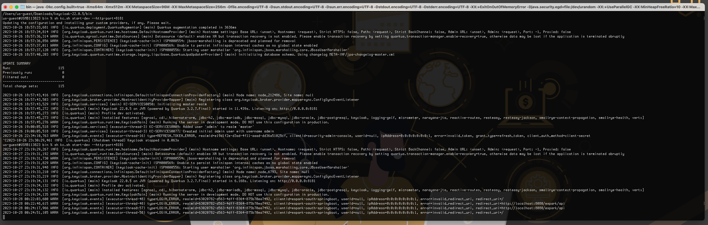
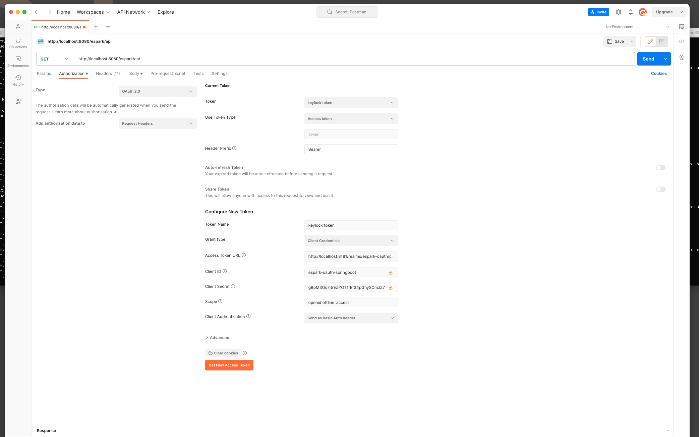
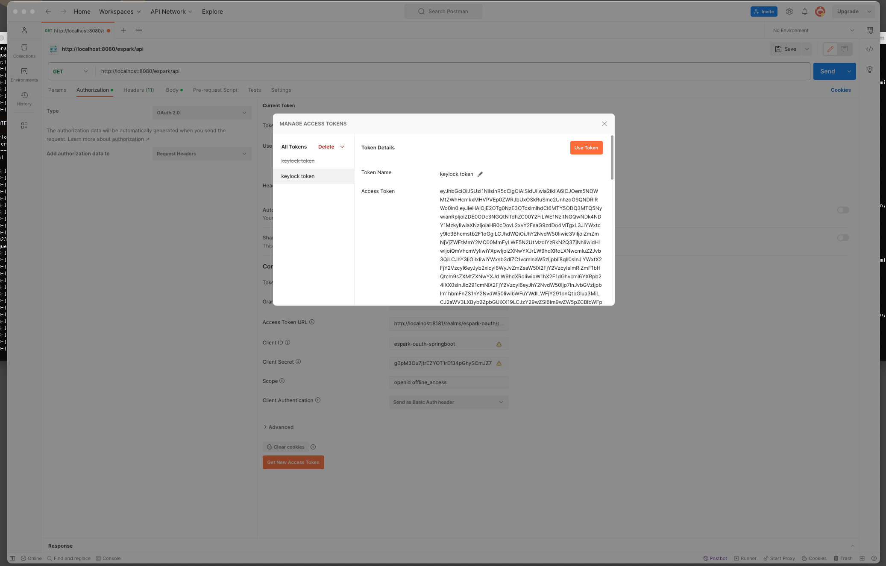
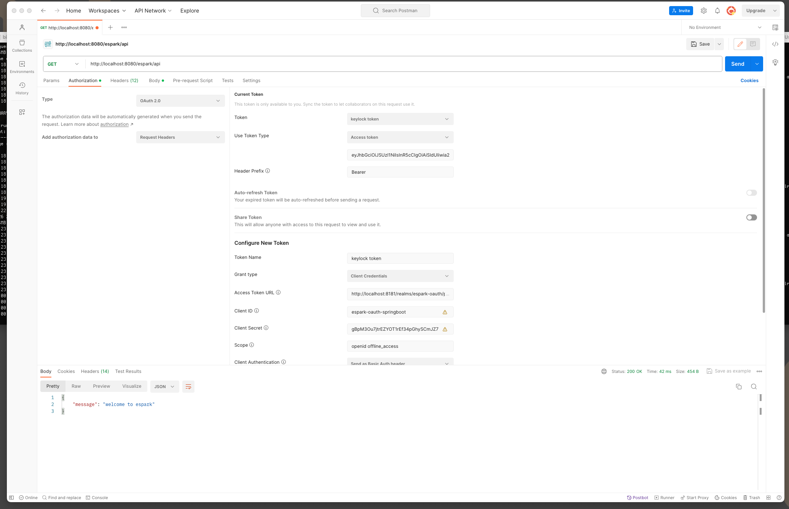

# Getting Started


# To download
* https://www.keycloak.org/

# To start the applcation server
* keycloak-22.0.5/bin $ sh kc.sh start-dev --http-port=

# homepage url
* http://localhost:8181/

# create admin credentials by login into the
* Administration Console
* provide the adminname/adminpwd to create admin and login into the admin

# create Realm role
* espark-oauth


# To create client
* select client -> create client
```
clientid : espark-oauth-springboot
name :espark-oauth-springboot
next->
client authentication :on
authenticaton flow : std flow -> disable
direct access flow -> disable
service account role -> enabled
next ->
save ->

clientId: espark-oauth-springboot
client secret gBpM3Ou7jtrEZYOT1rEf34pGhySCmJZ7
```

## keylock all data api url 
* http://localhost:8181/realms/espark-oauth/.well-known/openid-configuration





