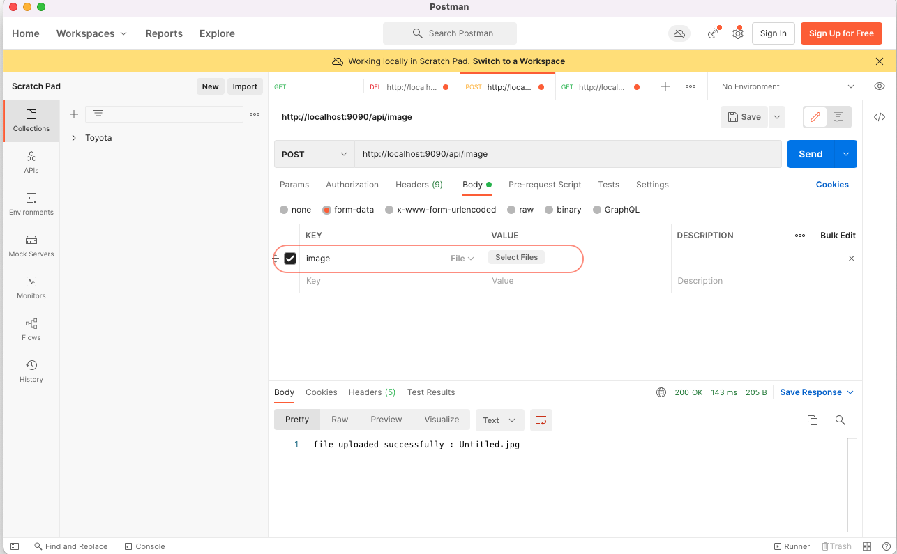
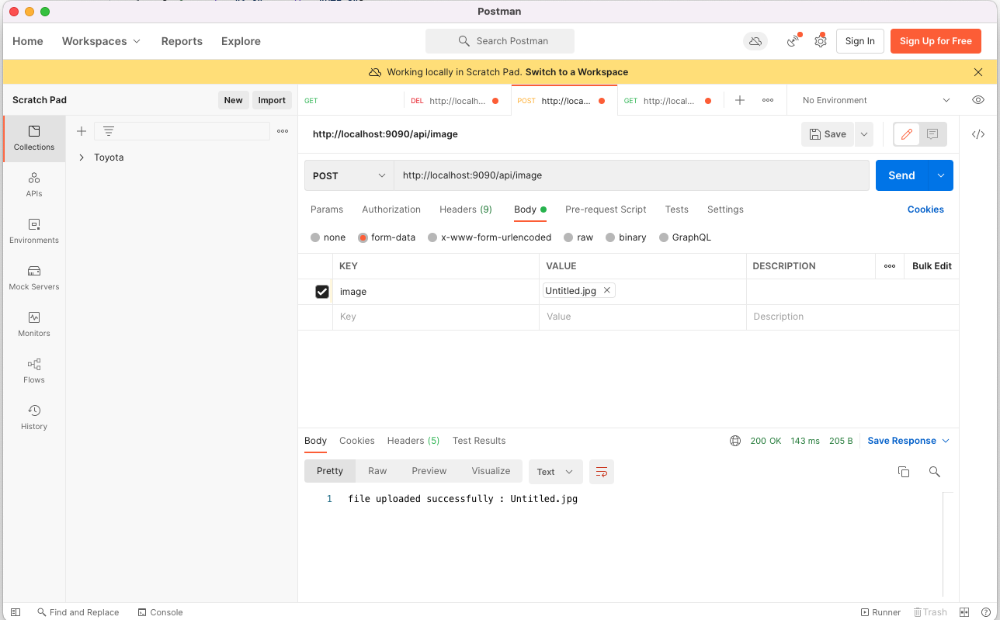

# spring-boot file upload rest example 

--- 

### h2 db console url 
* http://localhost:9090/h2-console 
* root/root

## api post url 
* http://localhost:9090/api/image
* form param name "image"
## curl cmd 
* curl --location --request POST 'http://localhost:9090/api/image' \
  --form 'image=@"/Users/us-guest/Documents/Untitled.jpg"'

## api get url
* http://localhost:9090/api/image/Untitled.jpg
## curl cmd 
* curl --location --request GET 'http://localhost:9090/api/image/Untitled.jpg' 