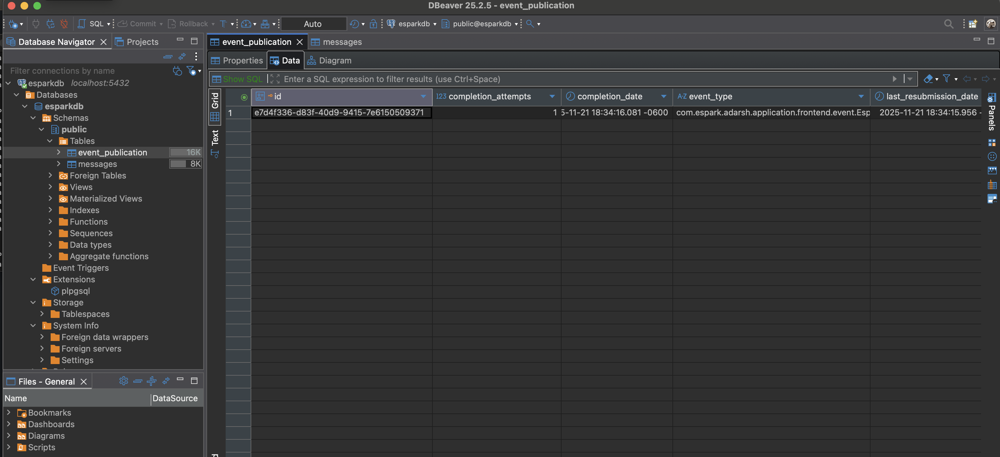
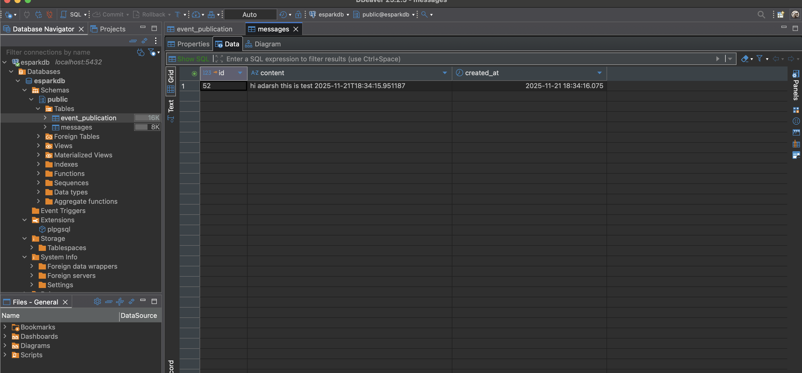

# spring boot event listener

---

### Docker cmd 
```
docker run --name espark-postgres -e POSTGRES_PASSWORD=root -e POSTGRES_USER=root -e POSTGRES_DB=esparkdb -p 5432:5432 -d postgres
```

### To login into postgres container
```
docker exec -it espark-postgress psql -U root -d esparkdb
``` 

### To create table in postgres
```

```

### To run the spring boot application
```
mvn spring-boot:run
```

### To test the application
```
curl -X POST http://localhost:8080/event \
  -H "Content-Type: application/json" \
  -d '{"message":"hi adarsh this is test"}'
```




### logs while execution 
```
2025-11-21T18:34:15.951-06:00  INFO 15024 --- [springboot-events] [nio-8080-exec-1] c.e.a.a.f.web.ApplicationController      : Received request to trigger event with message: hi adarsh this is test 2025-11-21T18:34:15.951187
2025-11-21T18:34:15.965-06:00  INFO 15024 --- [springboot-events] [nio-8080-exec-1] c.e.a.a.f.service.ApplicationService     : Event Published with message: hi adarsh this is test 2025-11-21T18:34:15.951187
Hibernate: insert into event_publication (completion_attempts,completion_date,event_type,last_resubmission_date,listener_id,publication_date,serialized_event,status,id) values (?,?,?,?,?,?,?,?,?)
Hibernate: update event_publication djep1_0 set status=? where djep1_0.id=? and djep1_0.status<>?
2025-11-21T18:34:16.075-06:00  INFO 15024 --- [springboot-events] [         task-1] c.e.a.a.b.l.ApplicationEventListener     : Event Received: hi adarsh this is test 2025-11-21T18:34:15.951187
Hibernate: select nextval('messages_seq')
Hibernate: insert into messages (content,created_at,id) values (?,?,?)
Hibernate: update event_publication djep1_0 set status='COMPLETED',completion_date=? where djep1_0.id=?
```

