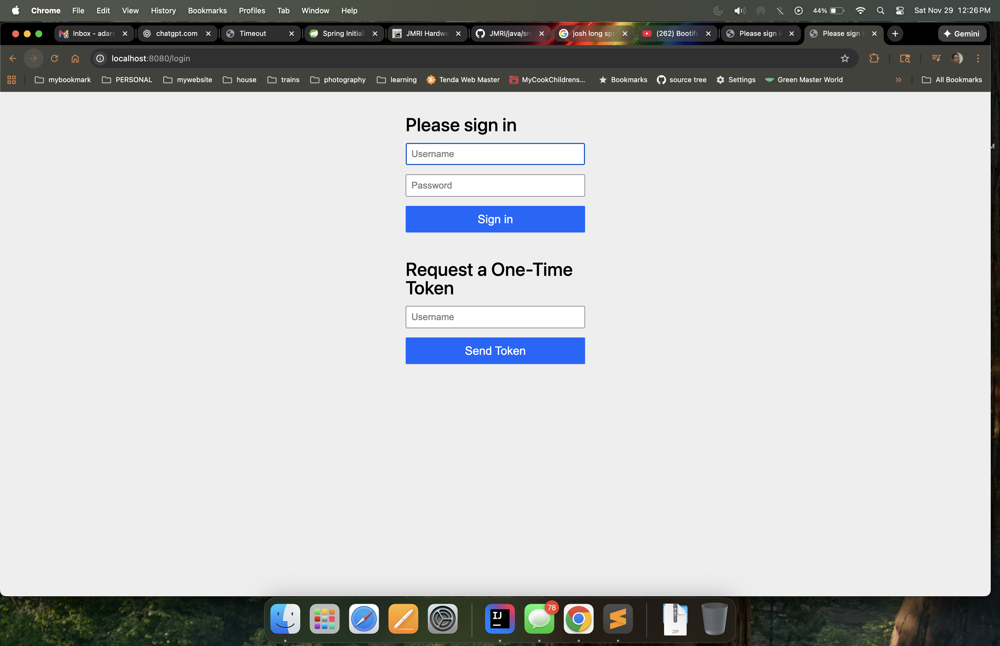
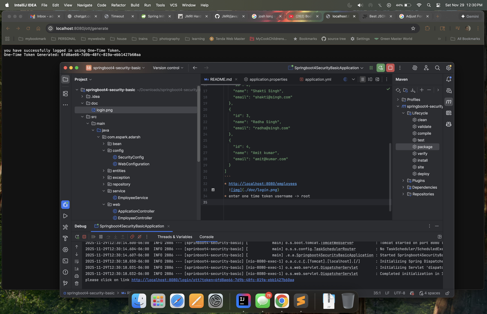
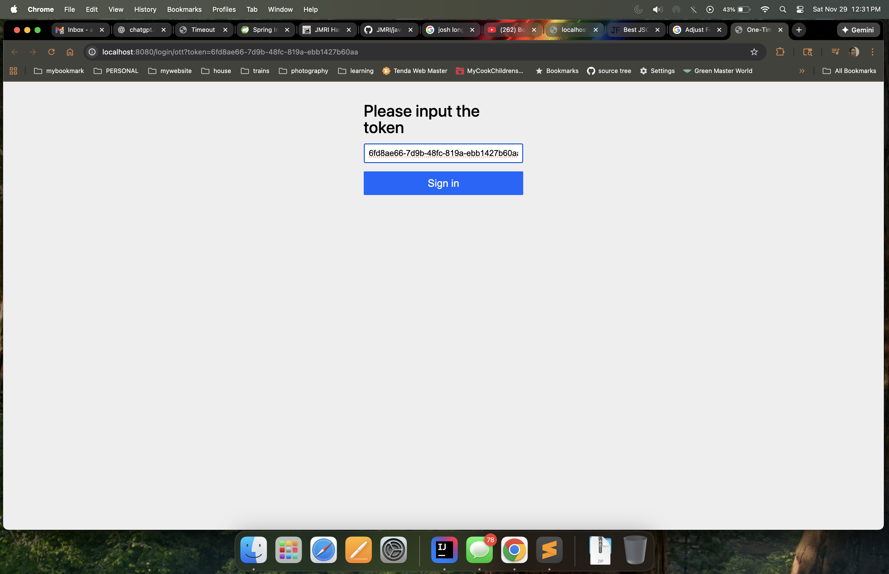

# SPRING SECURITY 4 - BASICS

---

* http://localhost:8080/employees 

* enter the root/root 
```
[
  {
    "id": 1,
    "name": "adarsh kumar",
    "email": "adarsh@kumar.com"
  },
  {
    "id": 2,
    "name": "Shakti Singh",
    "email": "shakti@singh.com"
  },
  {
    "id": 3,
    "name": "Radha Singh",
    "email": "radha@singh.com"
  },
  {
    "id": 4,
    "name": "Amit kumar",
    "email": "amit@kumar.com"
  }
]
```
* http://localhost:8080/employees
  
* enter one time token username -> root
  
* click on the url on console
  
```
[
  {
    "id": 1,
    "name": "adarsh kumar",
    "email": "adarsh@kumar.com"
  },
  {
    "id": 2,
    "name": "Shakti Singh",
    "email": "shakti@singh.com"
  },
  {
    "id": 3,
    "name": "Radha Singh",
    "email": "radha@singh.com"
  },
  {
    "id": 4,
    "name": "Amit kumar",
    "email": "amit@kumar.com"
  }
]
```